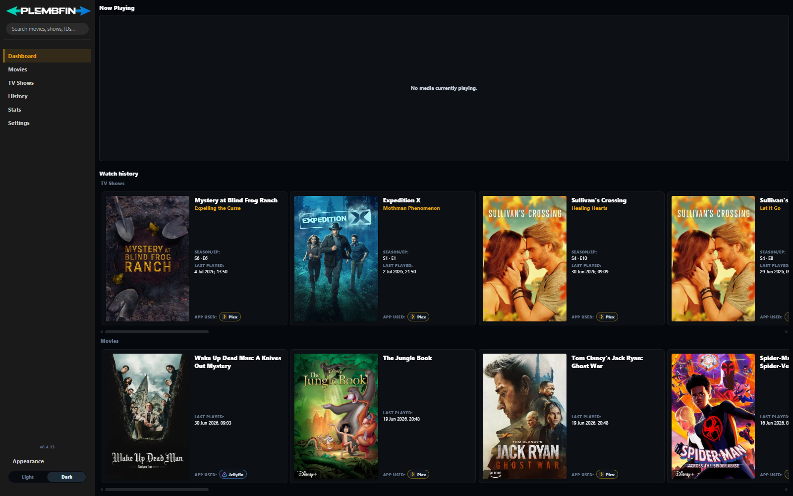
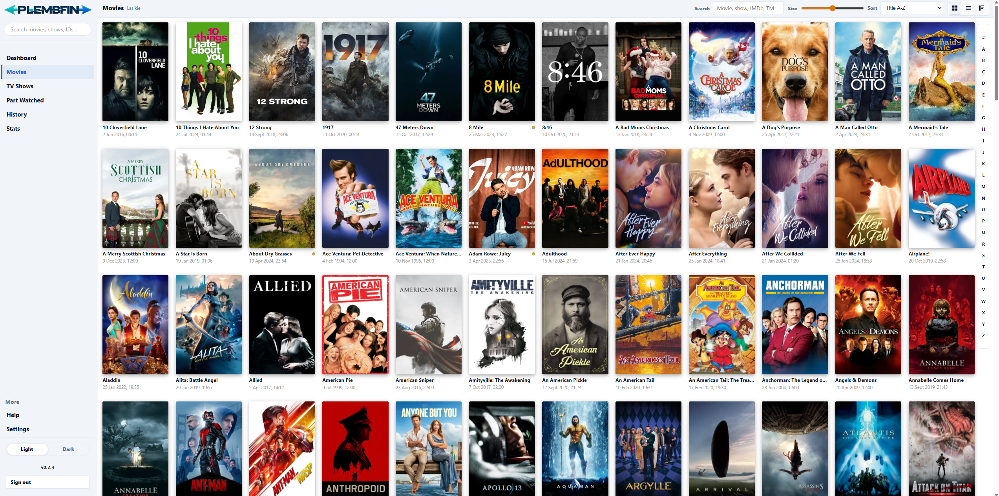
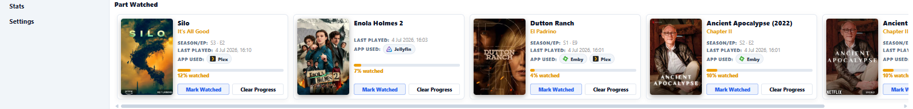
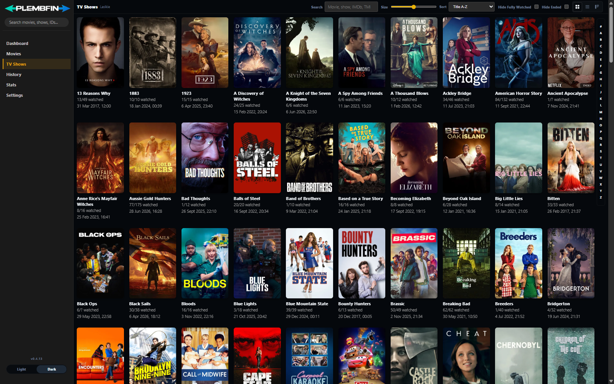
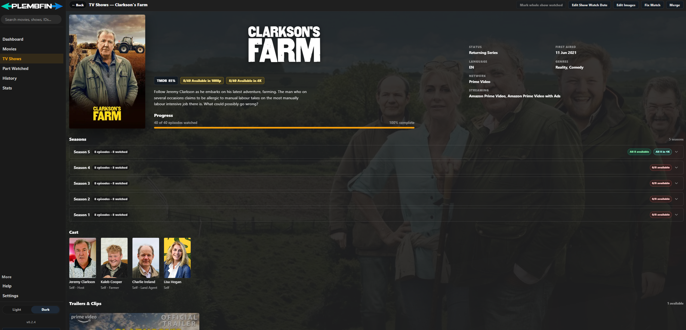
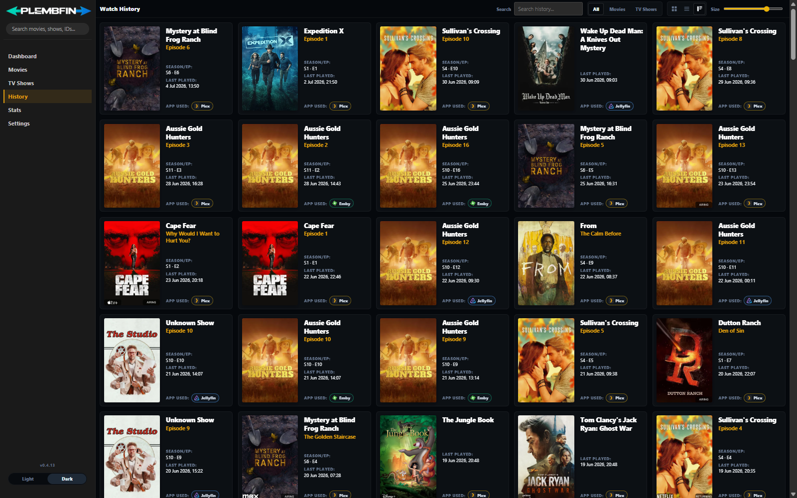
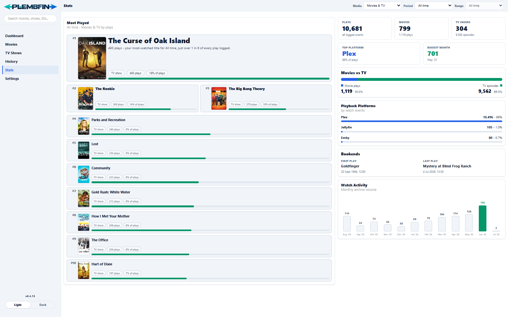
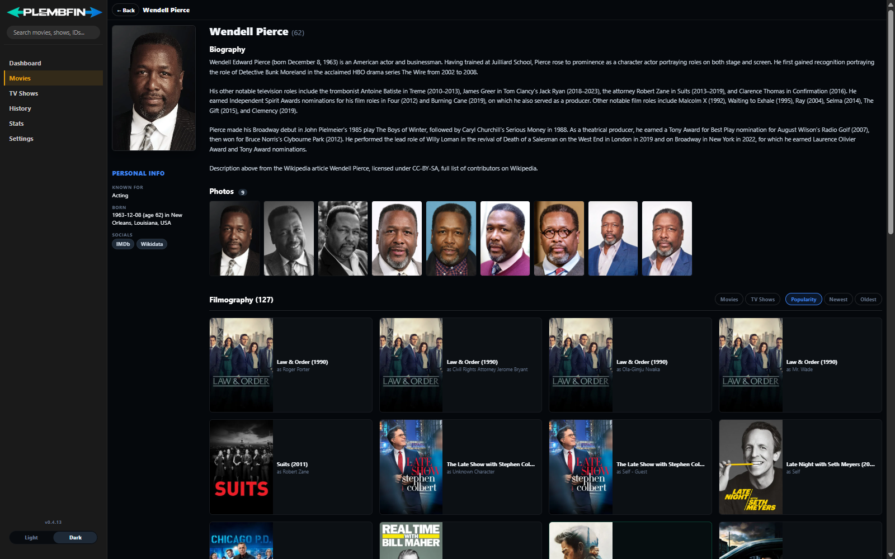
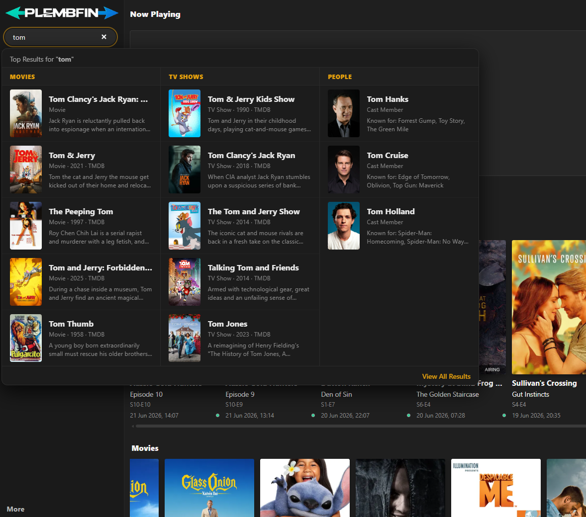

<p align="center">
  <picture>
    <source media="(prefers-color-scheme: dark)" srcset="public/plembfin_header_logo_dark.png">
    <source media="(prefers-color-scheme: light)" srcset="public/plembfin_header_logo_light.png">
    
  </picture>
</p>

<p align="center">
  
  
  
  
</p>

---

**Plembfin** is a self-hosted watch history tracker and playstate sync tool for Plex, Emby, and Jellyfin. It records everything you watch in a local SQLite database and keeps your watched/unwatched state in sync across all your media servers automatically.

---

## Features

| | |
|---|---|
| **Bi-directional sync** | Watched/unwatched states stay in sync across Plex, Emby, and Jellyfin automatically |
| **Resume progress sync** | Pause on one server, pick up exactly where you left off on another |
| **Now Playing dashboard** | Real-time active sessions, weekly charts, and recent watch history |
| **Stats** | All-time and per-period reports with top shows, platform breakdowns, and watch trends |
| **Upcoming episodes** | Month calendar with historical and future TV air dates, mobile agenda layout, and cross-month search |
| **Trakt import** | Import your full Trakt history and push it out to all connected servers |
| **Seerr integration** | Request movies and shows from detail pages via Overseerr or Jellyseerr |
| **Movie collections** | Movie pages show a poster row of other films in the same franchise (sequels, prequels, spin-offs) |
| **Open-in-app links** | Detail pages and Part Watched cards link straight to the item in Plex, Emby, or Jellyfin when it exists in that server's library |
| **Automated backups** | Daily local backups with optional mirror to Backblaze B2 |
| **Self-hosted & private** | SQLite on your own hardware — no cloud accounts required |
| **Security hardening** | Strict CSP headers, scrypt hashing, rate-limited login, HMAC-signed sessions |
| **Artwork pipeline** | Posters and logos fetched from TMDB, TheTVDB, and Fanart.tv, resized and cached locally; the per-title artwork picker includes a manual search for titles that fail to match automatically |
| **Accurate TV episode data** | TV show names, seasons, episode numbering, titles, and air dates are sourced from TheTVDB; cast, trailers, reviews, and recommendations are sourced from TMDB |

---

## Screenshots

<p align="center">
  
  <em>Dashboard showing live playback status and recent watch history</em>
</p>

<p align="center">
  
  <em>Full poster grid with search, filters, and sort options</em>
</p>

<p align="center">
  
  <em>Part Watched dashboard section: in-progress items with resume progress and quick mark-watched actions</em>
</p>

<p align="center">
  
  <em>TV Shows library with rich show details</em>
</p>

<p align="center">
  
  <em>Movie and show detail pages with cast, trailers, reviews, images, and recommendations</em>
</p>

<p align="center">
  
  <em>Complete watch log across all connected platforms</em>
</p>

<p align="center">
  
  <em>All-time play counts, top shows, platform breakdowns, and monthly watch activity</em>
</p>

<p align="center">
  
  <em>Biography, photos, and full filmography pulled from TMDB</em>
</p>

<p align="center">
  
  <em>Instant search results across movies, TV shows, and people</em>
</p>

---

## Getting Started

### Method A: Docker Compose (Recommended)

1. Create a `docker-compose.yml` file:
   ```yaml
   services:
     plembfin:
       image: plembfin:latest
       build: .
       container_name: plembfin
       ports:
         - "5055:5055"
       volumes:
         # Database, configuration, and cached posters are persisted here
         - ./data:/data
       environment:
         - ADMIN_USERNAME=admin
         - ADMIN_PASSWORD=changeme # Change this before starting the container
         # Optional: Pin a specific API key (otherwise auto-generated)
         # - API_KEY=your-secure-webhook-api-key
         # Optional: Pin a session cookie signing secret
         # - SESSION_SECRET=your-secure-session-secret
       restart: unless-stopped
   ```
2. Build and start the container:
   ```bash
   docker compose up -d --build
   ```
3. Open `http://localhost:5055` in your browser and log in with your configured credentials.

> [!TIP]
> For a hardened production setup (read-only filesystem, required secrets, `COOKIE_SECURE`), use the secure overlay:
> ```bash
> docker compose -f docker-compose.yml -f docker-compose.secure.yml up -d
> ```
> See [`docs/hardening.md`](docs/hardening.md) for the full guide including HTTPS reverse-proxy setup.

---

### Method B: Bare Metal (Node.js)

#### Prerequisites
*   Node.js 20+
*   Native build tools (required for compiling `better-sqlite3` and `sharp` if prebuilt binaries fail).
    *   **Windows**: Install [VS Build Tools](https://visualstudio.microsoft.com/visual-cpp-build-tools/) if needed.
    *   **Linux/macOS**: Install standard build tools (`gcc`/`g++` / `make`).

#### Steps
1. Install dependencies:
   ```bash
   npm install
   ```
2. Start the server:
   ```bash
   npm start
   ```
   *For live reloading during development, run `npm run dev` instead.*
3. Access the dashboard at `http://localhost:5055`. On a fresh boot the username defaults to `admin`; if you didn't set `ADMIN_PASSWORD`, check the server console/logs for the randomly generated initial password.

> [!TIP]
> If port `5055` is occupied, change it using the `PORT` environment variable:
> *   **Bash**: `PORT=5056 npm start`
> *   **PowerShell**: `$env:PORT=5056; npm start`

---

## Full Setup & Integration Guide

### 1. Sign In & Set Admin Credentials
Sign in with `admin` and the password you set via `ADMIN_PASSWORD`, or the random password Plembfin generated and printed to the console on first boot. If the configured admin password is the insecure default `admin`, Plembfin redirects to **Settings → Account** with a security banner until the password is changed.

### 2. Connect Your Media Apps
Go to **Settings → Media Servers**. Select an existing card to edit it, or use the
**+** card to add Plex, Emby, Jellyfin, or Seerr. Each media-server dialog has its own
Save and Test actions:

#### Plex Integration
*   Enable Plex.
*   **Plex Server URL**: Your Plex server network address (e.g., `http://192.168.1.100:32400`).
*   **Plex Token**: Your Plex authentication token ([How to find your Plex Token](https://support.plex.tv/articles/204059436-finding-an-authentication-token-x-plex-token/)).
*   **Plex Username**: Your Plex account username.

#### Emby Integration
*   Enable Emby.
*   **Emby Server URL**: Your Emby server address (e.g., `http://192.168.1.100:8096`).
*   **Emby API Key**: Generate an API key in Emby Settings → API Keys.
*   **Emby User ID**: The unique ID of the user whose playback you want to track (can be grabbed from the URL when viewing the user profile in Emby dashboard).

#### Jellyfin Integration
*   Enable Jellyfin.
*   **Jellyfin Server URL**: Your Jellyfin server address (e.g., `http://192.168.1.100:8096`).
*   **Jellyfin API Key**: Generate an API key in Jellyfin Dashboard → API Keys.
*   **Jellyfin User ID**: The unique ID of your user (copied from the URL when viewing user options in Jellyfin settings).

#### TMDB (Metadata & Posters)
*   **TMDB API Key**: Obtain a free API key from [TheMovieDB](https://www.themoviedb.org/documentation/api) and paste it here. This enables search capability on the dashboard, rich cast lists, trailers, recommendations, and poster fallbacks. Movies are sourced entirely from TMDB.

#### TheTVDB (TV Show Episode Data)
*   Plembfin includes a built-in project key for [TheTVDB](https://thetvdb.com) — no setup is required. TV show names, seasons, episode numbering, titles, and air dates are sourced from TheTVDB, since it is often more accurate for TV episode ordering. Cast, trailers, reviews, and recommendations are sourced from TMDB.
*   **Personal API Key (optional)**: Register at thetvdb.com (Dashboard → API Keys) and enter your personal key under **Settings → Metadata Providers → TheTVDB** for your own request quota.

#### Fanart.tv (Artwork Fallback)
*   Plembfin includes a built-in project key for [Fanart.tv](https://fanart.tv) — no setup is required. Fanart.tv is queried after TMDB as a fallback/additional source for posters, backdrops, and transparent logo art.
*   **Personal API Key (optional)**: Register at fanart.tv and enter your personal key under **Settings → Metadata Providers → Fanart.tv** to get higher rate limits and access to your own uploaded artwork.

#### OMDb (IMDb Ratings)
*   **Optional**: Register for a free API key at [omdbapi.com](https://www.omdbapi.com/apikey.aspx) (1,000 req/day free tier) and paste it under **Settings → Metadata Providers → OMDb**.
*   When configured, IMDb ratings appear as a rating badge (e.g. **IMDb 85%**) next to the TMDB score on media detail pages. If no OMDb key is configured, IMDb rating badges are hidden. Ratings are cached locally for 7 days. Can also be set via the `OMDB_API_KEY` environment variable.

#### Seerr (Request Manager)
*   **Seerr Server URL**: Your Overseerr or Jellyseerr server URL (e.g., `http://192.168.1.100:5055`).
*   **Seerr API Key**: Copy the API key from your Seerr Settings → General.
*   Availability badges are based on Plembfin's configured Plex, Emby, and Jellyfin apps, not Seerr's cached availability state.
*   Each episode row on a TV show's detail page shows its resolution (e.g. 720p, 1080p, 4K) when the episode is available in one of the configured apps.
*   Requesting a TV show opens a season picker listing every season (with current availability), so you can choose exactly which seasons to send to Seerr instead of requesting the whole series.
*   Availability and resolution lookups are cached in memory for 3 minutes per title, so reopening a detail page doesn't re-query Plex/Emby/Jellyfin/Seerr every time; submitting a request clears that title's cache immediately.
*   The browser also remembers the last known availability and open-in-app links for each title, so detail pages show availability badges and app buttons instantly on open and refresh them silently in the background when anything changed.

#### Sync Tuning and Match Diagnostics
*   **Settings → General → Sync Tuning** controls the watched threshold, minimum resume position, active-session TTL, and default outbound timeout. Blank fields inherit their environment variable or built-in default.
*   **Settings → Sync → Sync Issues** includes a Cross-Platform Match Report showing which media each target library could not match, with unique-media counts and representative samples for Plex, Emby, and Jellyfin.

---

## Webhook Setup (Critical for Live Sync)

Playback events are sent to Plembfin via webhooks. Plembfin accepts the webhook secret in the `X-Plembfin-Webhook-Secret` header, as `Authorization: Bearer <secret>`, or in the compatibility query-token URL used by Plex/Emby/Jellyfin. Copy the full URL from **Settings → Webhooks** after signing in. It will look like:

```
http://<YOUR_HOST>:5055/api/webhook?token=<your-secret>
```

> [!IMPORTANT]
> Use the full URL including the `?token=` parameter for media servers that cannot set custom headers. If you rotate the secret via the **Rotate Secret** button, update the URL or header value in every sender.

### Media Server Settings

#### 1. Plex Webhook Setup
1.  Navigate to Plex Web → **Account Settings → Webhooks**.
2.  Click **Add Webhook**.
3.  Paste the full webhook URL (with `?token=`) from **Settings → Webhooks**.
4.  Enable events: `media.play`, `media.resume`, `media.pause`, `media.stop`, `media.scrobble`.
5.  Save changes.

> **Plex library watch-state sync:** Plex does not reliably send native webhooks for watch-state changes made from its library UI. Plembfin includes a built-in notification listener that connects automatically via WebSocket using your configured Plex URL and token, records watched changes, and handles unscrobble events without an external script.

#### 2. Emby Webhook Setup
1.  Go to Emby Server Settings → **Webhooks** and add a new webhook.
2.  Set the URL to the full webhook URL (with `?token=`) from **Settings → Webhooks**.
3.  Under **Events → Playback**, check: `Start`, `Pause`, `Unpause`, `Stop`.
4.  Under **Events → Users**, check: `Mark Played`, `Mark Unplayed`.
5.  Enable **Send All Properties** so payloads include position data for resume sync.

#### 3. Jellyfin Webhook Setup
1.  Install the **Webhooks** plugin from the Jellyfin Plugin Catalog.
2.  Add a new **Generic Webhook** named `plembfin`.
3.  Set the URL to the full webhook URL (with `?token=`) from **Settings → Webhooks**.
4.  Under **Notification Type**, check: `Playback Start`, `Playback Progress`, `Playback Stop`, `User Data Saved`.
5.  Under **Item Type**, select: `Movies`, `Episodes`.
6.  Check **Send All Properties (ignores template)** and save.

---

## Backup & Restore System

Plembfin runs automated daily backups at a customizable time. 

### Supported Backup Types

*   **Local Watch History Backups**: Capture watch history snapshots, playstates, and resume markers. Saved to `data/backups/watch-history`.
*   **Local Plembfin Backups**: Create full, AES-256-GCM encrypted database backups (including settings, API keys, credentials, and play history, excluding cache). Manual backups can use a one-time passphrase; scheduled backups require a remembered passphrase. Saved to `data/backups/plembfin`.
*   **Remote Backups**: Mirror local watch-history and full encrypted Plembfin backups to one or more private Backblaze B2 destinations under **Settings → Backup Settings → Remote**. Select a destination card to edit/test it, or use **+** to add one.

---

## Backfills & Imports

### Trakt Watch History Import
1. Download a JSON watch history export of your Trakt profile.
2. Go to **Settings → Import**, upload the JSON, and start the import.
3. Once completed, use **Settings → Tools → Library Rebuilds and Backfills → Full Sync Watchstates** to propagate the Trakt watch history to all connected Plex, Emby, and Jellyfin servers.

---

## Configuration Reference

The following environment variables can be set in your system or defined in `docker-compose.yml`:

| Environment Variable | Default | Purpose |
| :--- | :--- | :--- |
| `PORT` | `5055` | The network port the web interface and API will listen on. |
| `DATA_DIR` | `./data` | Directory for the SQLite database (`plembfin.db`), configs, and cached posters. |
| `ADMIN_USERNAME` | `admin` | Default administrator username for fresh setups. |
| `ADMIN_PASSWORD` | _generated_ | Admin password. If unset on a brand-new install, a random password is generated and printed once to the server console/logs. This env var controls login until credentials are changed in Settings or sessions are revoked; then `authManagedInApp` in `data/config.json` takes precedence. |
| `API_KEY` | _generated_ | Security token used to authorize incoming webhooks and API calls. |
| `WEBHOOK_SECRET` | _generated_ | Secret used by webhook header/Bearer auth and the compatibility `?token=` URL. Rotatable independently of the API key. |
| `SESSION_SECRET` | _generated_ | Signing secret for the dashboard session cookie. |
| `COOKIE_SECURE` | `false` | Set to `true` when the app is served behind an HTTPS reverse proxy — enables `Secure` cookie flag and `Strict-Transport-Security` header. |
| `FANART_API_KEY` | _none_ | Optional personal Fanart.tv API key for higher rate limits. A built-in project key is used when this is unset. |
| `TVDB_API_KEY` | _none_ | Optional personal TheTVDB API key for a higher personal rate limit. A built-in project key is used when this is unset. |
| `TVDB_PROJECT_KEY` | _built-in_ | Advanced: replaces the built-in shared TheTVDB project key. Only needed if the built-in key is revoked or exhausted. |
| `FANART_PROJECT_KEY` | _built-in_ | Advanced: replaces the built-in shared Fanart.tv project key. Only needed if the built-in key is revoked or exhausted. |
| `TMDB_API_KEY` | _none_ | Default TMDB API key (Settings → Metadata Providers takes precedence). |
| `YOUTUBE_API_KEY` | _none_ | Optional YouTube Data API key for trailer metadata (Settings takes precedence). |
| `OMDB_API_KEY` | _none_ | Optional OMDb API key. When set, IMDb ratings are fetched and displayed as a rating badge on media detail pages. Free tier: 1,000 req/day. |
| `PLEX_SERVER_URL` / `PLEX_TOKEN` / `PLEX_USERNAME` / `PLEX_ENABLED` | _none_ | Default Plex connection values. Anything saved in Settings → Media Servers takes precedence. |
| `EMBY_SERVER_URL` / `EMBY_API_KEY` / `EMBY_USER_ID` / `EMBY_ENABLED` | _none_ | Default Emby connection values (Settings takes precedence). |
| `JELLYFIN_SERVER_URL` / `JELLYFIN_API_KEY` / `JELLYFIN_USER_ID` / `JELLYFIN_ENABLED` | _none_ | Default Jellyfin connection values (Settings takes precedence). |
| `WATCHED_PLAYED_SYNC_ENABLED` | `true` | Set to `false` to disable all watched/played propagation between platforms (watch recording still happens). |
| `CATCHUP_SYNC_INTERVAL_MS` | `900000` (15m) | The frequency (in milliseconds) of database-heavy catch-up library scans on Plex/Emby/Jellyfin. |
| `WATCHED_THRESHOLD_PERCENT` | `90` | Playback percentage that counts as watched (50–100). Settings → General → Sync Tuning takes precedence. |
| `MIN_RESUME_POSITION_SEC` | `60` | Minimum stopped-play position saved and propagated as resume progress (0–3600 seconds). Settings takes precedence. |
| `ACTIVE_SESSION_TTL_MIN` | `5` | Time without a webhook update before an active session is stale (1–120 minutes). Settings takes precedence. |
| `OUTBOUND_TIMEOUT_SEC` | `10` | Default timeout for media-server outbound requests (2–120 seconds). Explicit per-call timeouts still take precedence. |
| `PLEMBFIN_DEBUG_OUTBOUND` | _off_ | Set to `1` to log a per-host outbound HTTP request count once a minute (visible in Settings → Logs) — useful for measuring how much traffic each metadata service and media server receives. |

A commented template of every variable is provided in [`.env.example`](.env.example) — copy it to `.env` for bare-metal installs.

---

## Architecture & Under the Hood

Plembfin runs as a single-process Node application:
*   **Web Server**: Powered by Express (`server/server.js`), static-serving the SPA interface (`public/`) and poster binaries (`data/media`).
*   **Manual Router**: A lightweight dispatcher routing API endpoints to specific controllers.
*   **Database**: Uses `better-sqlite3` in WAL mode for rapid reading/writing and locks safety.
*   **Scheduler**: Runs in-process on a `setInterval` timer (no crontab required). It executes once per minute to reconcile active play states, check sync queues, maintain the TV next-airing cache, and perform nightly backups. Failed sync dispatches are retried with exponential backoff (up to 10 attempts) rather than every minute, so an offline media server never gets hammered.
*   **Pre-push build check**: Before code is deployed or pushed, `npm run build` is run automatically. This checks JavaScript syntax and boots the server temporarily in a clean directory on port 0 to verify startup health.

For the full technical reference — a complete map of every file in the repository, a task router, and per-feature deep dives (Plex/Emby/Jellyfin integrations, dashboard, libraries, upcoming episodes, media detail, backups, metadata, posters, auth) — start at [`docs/architecture.md`](docs/architecture.md) and the [docs index](docs/README.md).

---

## Development Workflow

### Running locally
```bash
npm install      # install dependencies
npm run dev      # start with auto-reload on http://localhost:5055
```

Commits for user-visible features, fixes, security changes, enhancements, and docs
must use a `type: summary` subject plus meaningful `- ` bullet points in the body.
The installed commit hook and CI changelog generator both reject title-only release
messages, preventing sparse entries in **Settings → About**. See
[`docs/development.md`](docs/development.md) for the full release workflow.

---

## License

Plembfin is licensed under the GNU Affero General Public License v3.0. See
[LICENSE.md](LICENSE.md). Version history is bundled in [changelog.json](changelog.json)
and shown in **Settings → About**.

---

## Thank You

Plembfin uses the following third-party services for artwork and metadata — thank you to the people and communities that make them possible:

*   **[The Movie Database (TMDB)](https://www.themoviedb.org)** — The primary source for movie metadata, posters, backdrops, cast information, and logo art, and the source of cast/trailers/recommendations for TV shows. This product uses the TMDB API but is not endorsed or certified by TMDB.
*   **[TheTVDB](https://thetvdb.com)** — The source of TV show names, seasons, episode numbering/titles/air dates, and artwork. Metadata provided by TheTVDB. Please consider adding missing information or subscribing.
*   **[Fanart.tv](https://fanart.tv)** — Community-driven source of high-quality poster art, backdrop images, and transparent logo art used as a fallback when TMDB images are unavailable. Thank you to all the fanart.tv contributors who upload and curate artwork.
