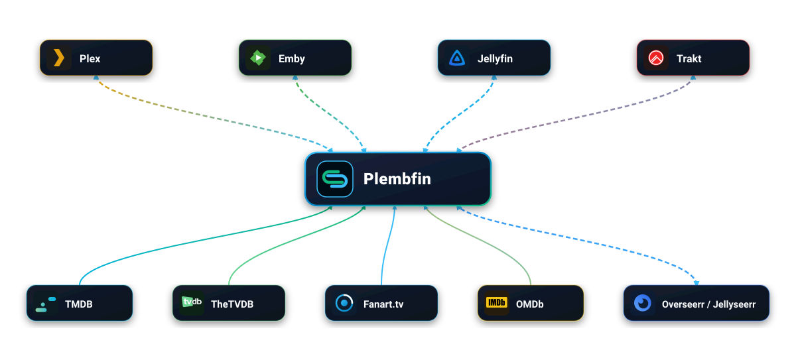
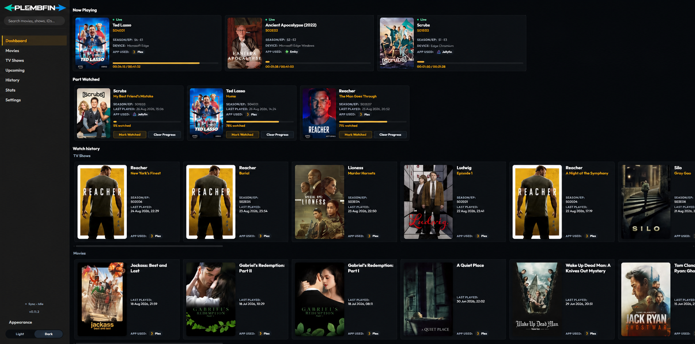
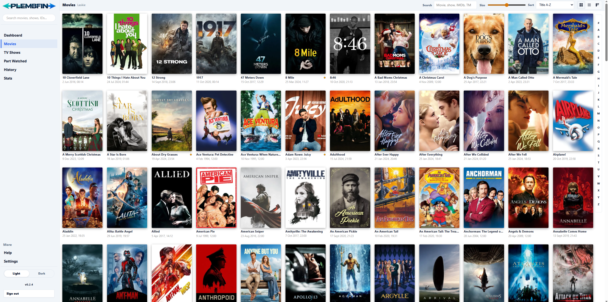
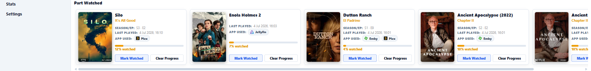
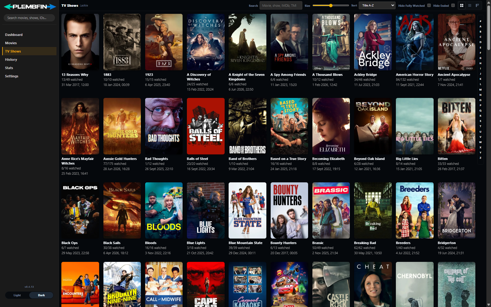
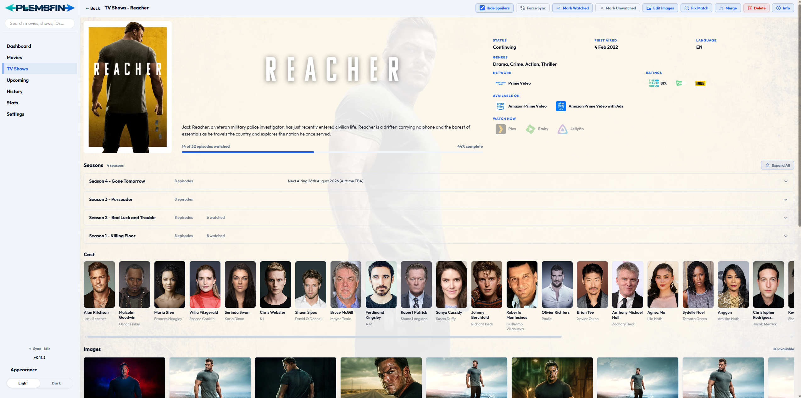
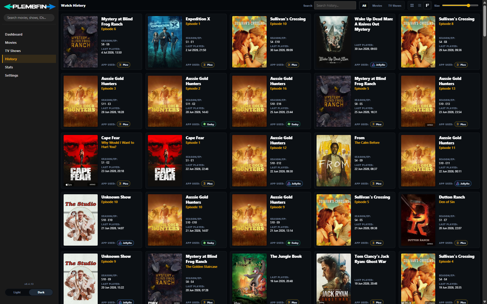
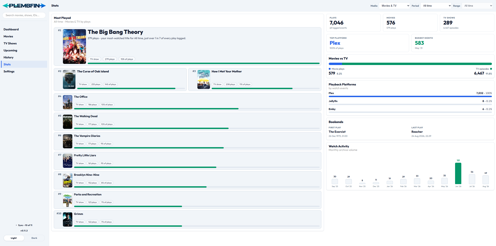
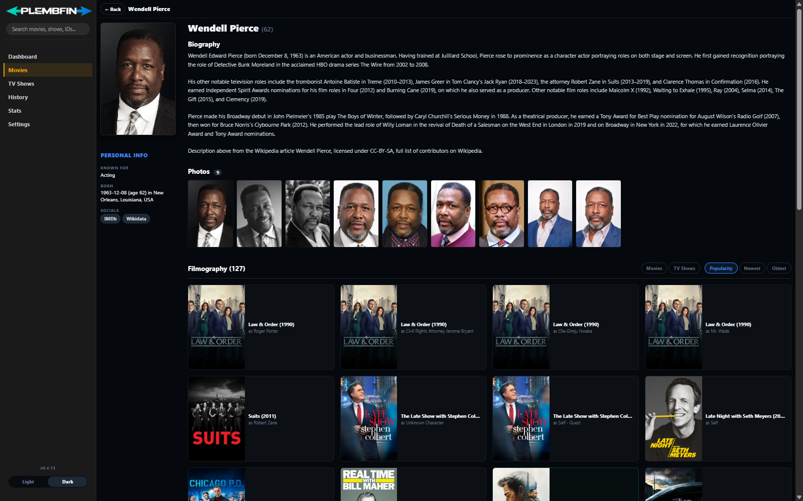
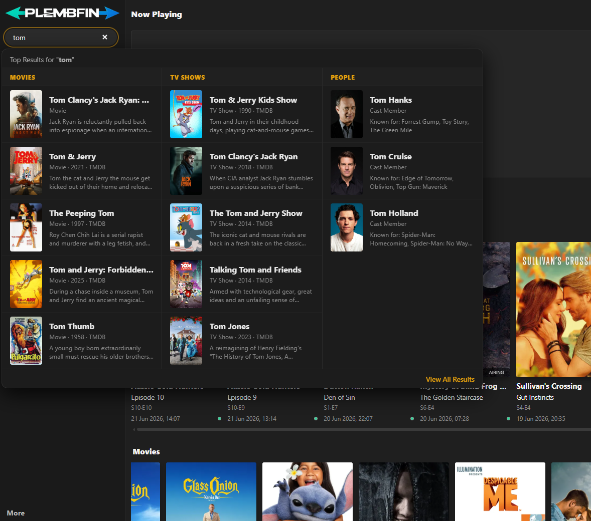

<p align="center">
  <picture>
    <source media="(prefers-color-scheme: dark)" srcset="public/plembfin_header_logo_dark.png">
    <source media="(prefers-color-scheme: light)" srcset="public/plembfin_header_logo_light.png">
    
  </picture>
</p>

<p align="center">
  
  
  
  
</p>

<p align="center">
  <a href="CHANGELOG.md">Changelog</a> ·
  <a href="#which-version-should-i-run">Which version should I run?</a> ·
  <a href="docs/README.md">Full documentation</a>
</p>

---

> **Pre-1.0 software.** Plembfin is still in early testing, on every release channel
> including `:latest`. The features below work, but expect bugs and occasional
> breaking changes. It writes watched state to your media servers, so **back up first**
> (Settings → Backup / restore → Backup settings). Report issues on the
> [issue tracker](https://github.com/Lasikiewicz/plembfin/issues).

---

**Plembfin** is the brain in the middle. Your media servers, Trakt, and Seerr don't talk
to each other - Plembfin remembers what you've watched and keeps everyone in sync.

## The hub

<p align="center">
  
</p>

None of these talk to each other - they all talk to Plembfin.

- **Remembers** every watch, once, locally in SQLite
- **Syncs** watched/unwatched state across Plex, Emby, Jellyfin, and Trakt
- **Enriches** with posters, cast, episodes, and ratings from TMDB, TheTVDB, Fanart.tv, and OMDb
- **Connects** to Overseerr/Jellyseerr for requests and availability

---

## Key Features

- **Canonical sync** - Seamless two-way sync keeps watched state aligned across every connected app with intelligent auto-reconciliation
- **Force Sync** - Flexible on-demand sync per-title (with season scoping) or library-wide with comprehensive live progress logging; title pushes finish local media servers before draining their bounded Trakt queue
- **Instant state restoration** - Automatically synchronizes watch history to newly added media and rebuilt server libraries
- **Cross-platform resume** - Pause playback on one server and pick up right where you left off on another
- **Rewatch tracking** - Full multi-watch history logging with smart deduplication that preserves authentic repeat viewings
- **Now Playing dashboard** - Real-time playback monitoring, weekly watch activity trends, and recent history
- **Sync Activity hub** - Live status indicator and dedicated activity stream detailing sync origins, destinations, delivery results, targeted retry for failed or skipped destinations, and downloadable logs
- **Rich analytics & stats** - In-depth all-time and period reports, top shows, and platform playback distribution
- **Upcoming episodes calendar** - Air date schedule for upcoming and past releases, pre-cached for instant loading
- **Live Trakt sync** - Two-way Trakt integration with seamless device authorization, per-play history import, and resilient sync protection
- **Seerr integration** - Discover and request movies and TV shows directly from detail pages via Overseerr or Jellyseerr
- **Movie collections** - Explore related franchise entries, sequels, prequels, and spin-offs directly from movie detail pages
- **Direct server deep links** - Quick one-click links to jump directly to any title in Plex, Emby, or Jellyfin
- **Automated backups** - Built-in daily local backups with optional scheduled offsite backups to Backblaze B2
- **Guided first-run setup** - A one-time account claim replaces the old generated-password dead end, followed by a resumable `/setup` wizard that connects media servers, adds metadata, configures webhooks, and optionally connects Trakt
- **Self-hosted & private** - Runs entirely on your own hardware with dedicated SQLite storage and full data ownership
- **Enterprise-grade security** - Hardened with strict Content Security Policy (CSP), scrypt password hashing, rate limiting, and HMAC session signing
- **High-performance artwork cache** - Fast local caching for high-resolution posters, backdrops, and logos from TMDB, TheTVDB, and Fanart.tv
- **Comprehensive metadata** - Precision episode titles, season numbering, and air dates from TheTVDB paired with rich cast, trailers, and reviews from TMDB
- **Unified multi-source search** - Blazingly fast search across your local libraries, TMDB, and TheTVDB with local media prioritized
- **Progressive Web App (PWA)** - Installable directly on iOS, Android, macOS, and Windows with a native app experience

See [`docs/architecture.md`](docs/architecture.md) for how each feature is actually built.

---

## Screenshots

<p align="center">
  
  <em>Dashboard showing live playback status and recent watch history</em>
</p>

<p align="center">
  
  <em>Full poster grid with search, filters, and sort options</em>
</p>

<p align="center">
  
  <em>Part Watched dashboard section: in-progress items with resume progress and quick mark-watched actions</em>
</p>

<p align="center">
  
  <em>TV Shows library with rich show details</em>
</p>

<p align="center">
  
  <em>Movie and show detail pages with cast, trailers, reviews, images, and recommendations</em>
</p>

<p align="center">
  
  <em>Complete watch log across all connected platforms</em>
</p>

<p align="center">
  
  <em>All-time play counts, top shows, platform breakdowns, and monthly watch activity</em>
</p>

<p align="center">
  
  <em>Biography, photos, and full filmography pulled from TMDB</em>
</p>

<p align="center">
  
  <em>Instant search results across movies, TV shows, and people</em>
</p>

---

## Getting Started

### Which version should I run?

Plembfin publishes three Docker tags, one per release channel. Most people should
just use `:latest` - the guidance below is for anyone who wants to help test fixes
before they're officially released.

| Tag | Branch | Stability | Who it's for |
|---|---|---|---|
| `ghcr.io/lasikiewicz/plembfin:latest` (**recommended**) | `main` | Tested, tagged releases only | Everyone. Used by the Docker Compose example below. |
| `ghcr.io/lasikiewicz/plembfin:alpha` | `alpha` | Pre-release; queued fixes not yet a numbered version | Testers who want fixes early and don't mind rough edges |
| `ghcr.io/lasikiewicz/plembfin:develop` | `develop` | Bleeding edge; every commit, least tested | Contributors and the most adventurous testers |

Each channel shows its own version in the sidebar and **Settings → About**. See
[`CHANGELOG.md`](CHANGELOG.md) for numbered releases, and
[`docs/development.md`](docs/development.md) for how the three channels relate.

To run a different channel, swap the `image:` tag in the Docker Compose example below -
everything else about setup is identical.

### Method A: Docker Compose (recommended)

1. Create a `.env` file beside the Compose file and fill in a unique admin password.
   Never commit this file:
   ```dotenv
   ADMIN_PASSWORD=
   ```
   The value must be filled in before starting the container.
2. Create a `docker-compose.yml`. This pulls the published `:latest` image directly -
   no local clone needed:
   ```yaml
   services:
     plembfin:
       image: ghcr.io/lasikiewicz/plembfin:latest
       container_name: plembfin
       ports:
         - "5055:5055"
       volumes:
         - ./data:/data
       environment:
         ADMIN_USERNAME: admin
         ADMIN_PASSWORD: "${ADMIN_PASSWORD:?Set ADMIN_PASSWORD in .env before starting}"
       restart: unless-stopped
   ```
3. Start it: `docker compose up -d`
4. Open `http://localhost:5055` and log in.

This base example is intended for a local or trusted network. For a remotely reachable
tester instance, use the secure overlay below behind an HTTPS reverse proxy or VPN, and
give each tester an isolated `data/` volume.

> [!TIP]
> Building from a local clone instead (for contributing changes)? Swap the `image:`
> line for `build: .`, then run `docker compose up -d --build`.

> [!TIP]
> Want a hardened production setup (read-only filesystem, required secrets,
> `COOKIE_SECURE`)? Clone the repo and use the bundled secure overlay:
> ```bash
> git clone https://github.com/Lasikiewicz/plembfin.git && cd plembfin
> docker compose -f docker-compose.yml -f docker-compose.secure.yml up -d
> ```
> See [`docs/hardening.md`](docs/hardening.md) for the full guide.

### Method B: Bare metal (Node.js)

Requires Node.js 22.19.0+, and native build tools if prebuilt binaries for
`better-sqlite3`/`sharp` fail to install (VS Build Tools on Windows, `gcc`/`g++`/`make`
on Linux/macOS).

```bash
npm install
npm start        # or: npm run dev, for auto-reload
```

Open `http://localhost:5055`. If you didn't set `ADMIN_PASSWORD`, the app shows a
one-time **Claim this Plembfin instance** screen - create the administrator username and
password there instead of looking for a generated password anywhere.

> [!TIP]
> Port `5055` taken? `PORT=5056 npm start` (bash) or `$env:PORT=5056; npm start` (PowerShell).

---

## Full Setup Guide

**1. Sign in or claim the instance.** If you set `ADMIN_PASSWORD`, sign in with `admin`
and that password (if it's still the default `admin`, you'll be sent to Settings to
change it). Otherwise, claim the instance on first load by creating an administrator
username and password - this can only be done once. Either path continues into the guided
`/setup` wizard, which is also reachable later from Settings → **Run setup guide**.

**2. Connect your media apps.** Settings → Media Servers → **+** to add Plex, Emby,
Jellyfin, or Seerr.

- **Plex** - Connect Plex account and pick your server (recommended), or enter a URL/token/username manually.
- **Emby** - Enter server URL, username, and password once to obtain a token (the password itself isn't stored), or use a manual API key + user ID.
- **Jellyfin** - Use Quick Connect to authorize from a signed-in client, or username/password, or a manual API key + user ID.

Only one connection mode is active per server at a time.

**3. Add metadata providers** (Settings → Metadata):

| Provider | Setup | Provides |
|---|---|---|
| TMDB | Free key from [themoviedb.org](https://www.themoviedb.org/documentation/api) - **required** | Movies, cast, trailers, recommendations |
| TheTVDB | Built-in key works out of the box; personal key optional for your own quota | TV episode titles/numbers/air dates |
| Fanart.tv | Built-in key works out of the box; personal key optional for higher limits | Poster/backdrop/logo fallback art |
| OMDb | Free key from [omdbapi.com](https://www.omdbapi.com/apikey.aspx), optional | IMDb rating badges |
| Seerr | Overseerr/Jellyseerr URL + API key, optional | Request buttons on detail pages |

**4. Tune sync behavior** (Settings → Sync): thresholds and timeouts under **Sync
Tuning**; a match report for anything Plembfin couldn't identify under **Sync Issues**.
New media that arrives already-watched in Plembfin is marked watched on the server
automatically - this needs the library-add webhook enabled per server (see
[webhooks.md](docs/webhooks.md#catching-up-newly-added-media)).

---

## Webhook Setup

Playback events reach Plembfin via webhooks. Copy your webhook URL from
**Settings → Media servers → Webhooks** - it looks like:

```
http://<YOUR_HOST>:5055/api/webhook?token=<your-secret>
```

> [!IMPORTANT]
> Use the full URL with `?token=` for servers that can't set custom headers. Rotating
> the secret means updating it everywhere it's used.

**Plex** - Account Settings → Webhooks → Add Webhook → paste the URL → enable `media.play`,
`media.resume`, `media.pause`, `media.stop`, `media.scrobble`.
Plex doesn't reliably send webhooks for library-UI watch changes, so Plembfin also
listens over WebSocket for those directly, and polls every 60 seconds as a backstop.

**Emby** - Server Settings → Webhooks → add one, paste the URL, enable **Playback**:
`Start`/`Pause`/`Unpause`/`Stop` and **Users**: `Mark Played`/`Mark Unplayed`. Leave
everything else unticked, and enable **Send All Properties**.

**Jellyfin** - Install the **Webhooks** plugin → add a **Generic Webhook** named
`plembfin` → paste the URL → enable `Playback Start/Progress/Stop` and `User Data
Saved` under Notification Type, `Movies`/`Episodes` under Item Type → check **Send All
Properties**.

---

## Backup & Restore

Plembfin runs automated daily backups; each type has its own schedule, retention, and
manual Back Up Now button.

- **Watch history backups** - snapshots of history, playstates, and resume markers (`data/backups/watch-history`)
- **Full Plembfin backups** - AES-256-GCM encrypted, includes settings/keys/credentials/history (`data/backups/plembfin`)
- **Remote backups** - optional mirror of either type to Backblaze B2, on its own schedule (Settings → Backup / restore → Backup settings → Remote)

---

## Importing Watch History

**From Trakt (one-time):** export your Trakt watch history as JSON, then upload it under
**Settings → Import**. Imported watches propagate automatically; use **Full Sync
Watchstates** afterward to replay everything to a newly connected server.

**Live Trakt sync (ongoing):** Settings → Import → **Connect Trakt**, authorize with the
displayed device code - no Trakt VIP or personal API credentials needed. Once connected,
watched/unwatched state flows both ways every minute, including individual rewatches.
Disable any Emby/Jellyfin Trakt plugins so Plembfin is the only Trakt writer. See
[`docs/webhooks.md`](docs/webhooks.md) for how this interacts with other sync sources.

---

## Diagnostics & Logs

**Settings → Logs** has a real-time log viewer: filter by category, download a full
`.log` file, and see web/worker output merged together. Set `LOG_VERBOSE=true` for full
per-request tracing when chasing a specific issue.

**Settings → Sync → Sync Issues** reports data-quality problems (duplicate watches,
episodes missing a season number, etc.) with a plain-language fix for each.

---

## Configuration Reference

Set these in your system environment or `docker-compose.yml`. A full commented template
is in [`.env.example`](.env.example).

| Environment Variable | Default | Purpose |
| :--- | :--- | :--- |
| `PORT` | `5055` | Port the web interface and API listen on. |
| `DATA_DIR` | `./data` | Directory for the database, configs, and cached posters. |
| `ADMIN_USERNAME` | `admin` | Default administrator username. |
| `ADMIN_PASSWORD` | _generated_ | Admin password; a random one is generated and logged if unset. Settings-changed credentials take precedence once set. |
| `API_KEY` | _generated_ | Token authorizing incoming webhooks and API calls. |
| `WEBHOOK_SECRET` | _generated_ | Secret for webhook auth; rotatable independently of `API_KEY`. |
| `SESSION_SECRET` | _generated_ | Signing secret for the session cookie. |
| `PLEMBFIN_CREDENTIAL_KEY` | _generated file_ | Optional external credential-vault key (64 hex chars or base64url). Keep with disaster-recovery material. |
| `PLEMBFIN_PUBLIC_URL` | _none_ | Fixed public origin for provider return links (`http(s)://host`, no path). |
| `PLEMBFIN_MEDIA_AUTH_ENABLED` | `true` | Set `false` to expose manual server setup only. |
| `COOKIE_SECURE` | `false` | Set `true` behind HTTPS to enable the `Secure` cookie flag and HSTS. |
| `TRAKT_CLIENT_ID` / `TRAKT_CLIENT_SECRET` | _built-in_ | Optional replacement for the bundled Trakt app. Both required together. |
| `LOG_VERBOSE` | `false` | Set `true` for full per-request tracing in Settings → Logs. |
| `FANART_API_KEY` | _none_ | Personal Fanart.tv key for higher rate limits. |
| `TVDB_API_KEY` | _none_ | Personal TheTVDB key for a higher personal quota. |
| `TVDB_PROJECT_KEY` / `FANART_PROJECT_KEY` | _built-in_ | Advanced: replaces the built-in shared project key if revoked. |
| `TMDB_API_KEY` | _none_ | Default TMDB key (Settings takes precedence). |
| `YOUTUBE_API_KEY` | _none_ | Optional key for trailer metadata (Settings takes precedence). |
| `OMDB_API_KEY` | _none_ | Optional key for IMDb rating badges. Free tier: 1,000 req/day. |
| `PLEX_SERVER_URL` / `PLEX_TOKEN` / `PLEX_USERNAME` / `PLEX_ENABLED` | _none_ | Default Plex values (Settings takes precedence). |
| `EMBY_SERVER_URL` / `EMBY_API_KEY` / `EMBY_USER_ID` / `EMBY_ENABLED` | _none_ | Default Emby values (Settings takes precedence). |
| `JELLYFIN_SERVER_URL` / `JELLYFIN_API_KEY` / `JELLYFIN_USER_ID` / `JELLYFIN_ENABLED` | _none_ | Default Jellyfin values (Settings takes precedence). |
| `WATCHED_PLAYED_SYNC_ENABLED` | `true` | Set `false` to disable watched/played propagation (recording still happens). |
| `CATCHUP_SYNC_INTERVAL_MS` | `900000` (15m) | Frequency of catch-up library scans. |
| `PLEX_UNWATCHED_POLL_INTERVAL_MS` | `60000` (1m) | Cadence of the Plex unwatched-reconciliation backstop poll. |
| `EMBY_JELLYFIN_UNWATCHED_POLL_ENABLED` | `true` | Set `false` to disable the equivalent Emby/Jellyfin backstop poll. |
| `EMBY_UNWATCHED_POLL_INTERVAL_MS` / `JELLYFIN_UNWATCHED_POLL_INTERVAL_MS` | `300000` (5m) each | Cadence of that poll when enabled. |
| `WATCHED_THRESHOLD_PERCENT` | `90` | Playback % counted as watched (50-100). Settings takes precedence. |
| `MIN_RESUME_POSITION_SEC` | `60` | Minimum position saved as resume progress (0-3600s). Settings takes precedence. |
| `ACTIVE_SESSION_TTL_MIN` | `5` | Time before an active session goes stale (1-120 min). Settings takes precedence. |
| `OUTBOUND_TIMEOUT_SEC` | `10` | Default outbound request timeout (2-120s). |
| `OUTBOUND_PACING_PROFILE` | `standard` | Outbound request pacing: `gentle`, `standard`, or `fast`. Settings → Sync → Sync Tuning's **Fast Local-Network Sync** checkbox toggles between `standard` and `fast` and takes precedence; only enable `fast` when Plex, Emby, and Jellyfin are all self-hosted on the same trusted local network as Plembfin. |
| `PLEMBFIN_DEBUG_OUTBOUND` | _off_ | Set `1` to log per-host outbound request counts once a minute. |

---

## Architecture

Plembfin runs as a self-hosted Node app (Express + `better-sqlite3` in WAL mode). The
default `ROLE=all` process runs everything; larger installs can split `web` and `worker`
roles against the same SQLite volume. A per-minute scheduler (leased in SQLite, no
crontab needed) handles sync reconciliation, cache maintenance, and nightly backups, with
exponential backoff for offline targets. Every push runs `npm run build` - a syntax
check plus a clean-directory boot test - before it ships.

For the full picture - file map, subsystem map, and per-feature references - start at
[`docs/architecture.md`](docs/architecture.md) and the [docs index](docs/README.md).

---

## Development Workflow

```bash
npm install
npm run dev      # auto-reload on http://localhost:5055
```

Work lands on `develop`; `alpha` and `main` only move on an explicit promotion, with
each promotion to `main` becoming one numbered release. See
[Which version should I run?](#which-version-should-i-run) for what that means as a
user, and [`docs/development.md`](docs/development.md) for the full workflow.

Every push to `develop`/`alpha` builds and publishes a rolling image
(`:develop`/`:alpha`, plus a build-numbered tag); PRs to `main` build and verify without
publishing - a breaking change is caught before release, not after.

The local pre-push gate is never bypassed during promotion. If its test run hits the
known transient failure, the workflow reruns the tests once and retries the push only
after they pass; the retried push must still pass the complete build gate.

---

## License

Plembfin is licensed under the GNU Affero General Public License v3.0. See
[LICENSE.md](LICENSE.md). Version history is in [`CHANGELOG.md`](CHANGELOG.md) (also
shown in **Settings → About**).

---

## Thank You

Plembfin relies on these third-party services for artwork and metadata:

- **[TMDB](https://www.themoviedb.org)** - movie metadata, posters, backdrops, cast, and TV cast/trailers/recommendations. This product uses the TMDB API but is not endorsed or certified by TMDB.
- **[TheTVDB](https://thetvdb.com)** - TV show names, seasons, episode numbering/titles/air dates, and artwork. Please consider adding missing information or subscribing.
- **[Fanart.tv](https://fanart.tv)** - community-curated poster, backdrop, and logo art used as a fallback. Thank you to everyone who uploads and curates there.
